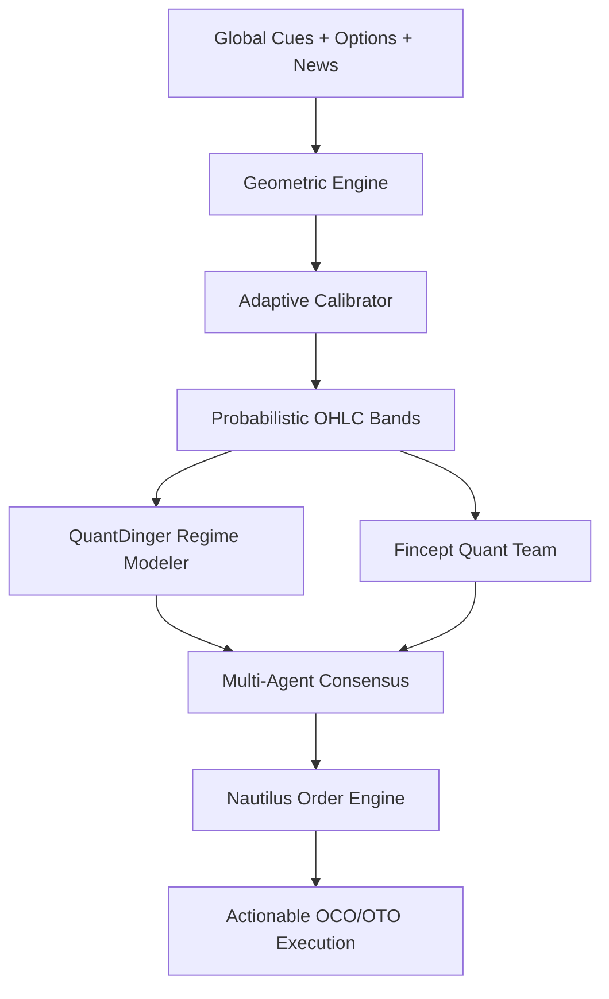

<div align="center">
  
# ⚡ ZERO V1.0 
**Adaptive Market Intelligence & Quantum Trading Terminal**

[](https://github.com/yourusername/ZERO)
[](https://github.com/yourusername/ZERO)
[](https://python.org)
[](https://numpy.org)
[](LICENSE)

*An institutional-grade, pre-market OHLC prediction and quantitative execution engine for the Indian Indices (Nifty 50, Bank Nifty, Sensex).*

</div>

---

## 📖 Table of Contents
- [Overview](#-overview)
- [What's New in V1.0](#-whats-new-in-v10)
- [Core Architecture](#-core-architecture)
- [The Quant Engines](#-the-quant-engines)
  - [Nautilus Order Engine](#1-nautilus-order-engine)
  - [Fincept Developer Platform](#2-fincept-developer-platform)
  - [QuantDinger Strategy Engine](#3-quantdinger-strategy-engine)
  - [Advanced Walk-Forward Backtester](#4-advanced-walk-forward-backtester)
  - [ZERO AI Brain (Gemini Knowledge Core)](#5-zero-ai-brain)
- [Getting Started](#-getting-started)
- [CLI Operations](#-cli-operations)
- [Security & Privacy](#-security--privacy)
- [Disclaimer](#-disclaimer)

---

## 🚀 Overview

**ZERO** fuses overnight global cues, NSE options chain data, and financial-news sentiment into highly accurate daily market predictions. Built entirely on top of optimized `numpy` and `pandas` routines, ZERO runs natively without requiring bloated third-party statistical frameworks (like PyTorch or TensorFlow). 

In **V1.0**, ZERO has evolved from a pure forecasting tool into a complete **Quantum Trading Terminal**. It clones state-of-the-art logic from `NautilusTrader`, `Fincept Terminal`, and `QuantDinger` to provide walk-forward backtesting, multi-agent consensus, automated order generation, and a fully interactive AI reasoning core.

---

## 🔥 What's New in V1.0

The V1.0 release introduces a massive architectural expansion, providing an institutional quant suite directly on your local machine:
- **Advanced Order Execution:** Precise Entry, Take Profit, and Stop Loss generation using complex bracket orders (OCO, OTO).
- **Quant Team Orchestrator:** Simulated multi-analyst desk (Strategist, Risk Analyst, Microstructure) providing a Unified Trade Thesis.
- **Smart Money Flow Detection:** UnusualWhales-style options flow analysis based on Put-Call Ratio (PCR) and OI walls.
- **Interactive AI Brain:** A Gemini-powered side console that dynamically reads your personal Obsidian notes and psychological biases to provide tailored trading advice.

---

## 🧠 The Quant Engines

### 1. Nautilus Order Engine
* **Event-Driven Execution:** Simulates deterministic multi-venue routing (NSE, BSE, MCX, GIFT) with exact slippage modeling.
* **TIF Matrix:** Native support for `IOC`, `FOK`, `GTC`, `GTD`, `DAY`, `POST_ONLY`, and `REDUCE_ONLY` execution instructions.
* **Contingency Chains:** Advanced bracket structures including `OCO` (One-Cancels-Other), `OTO` (One-Triggers-Other), and `OUO` (One-Updates-Other).

### 2. Fincept Developer Platform
* **Quant Team Orchestrator:** Simulates a multi-analyst consensus desk to debate and merge market outlooks into a single Unified Trade Thesis.
* **Options Flow & Sentiment:** Identifies dark pool hedging and institutional sweeps based on PCR and open interest concentration.
* **Derivatives & Macro:** Includes a pure-math Black-Scholes Greeks calculator (Delta, Gamma, Theta, Vega) and cross-asset inter-market correlation signals (US Futures, Crude, DXY, VIX).

### 3. QuantDinger Strategy Engine
* **Regime Classification:** Automatically classifies the market into states like `VOLATILE_RANGEBOUND`, `TRENDING_BULLISH`, `MACRO_SHOCK`, or `LOW_VOL_SQUEEZE`.
* **Dynamic Strategies:** Outputs fully calculated quantitative setups (e.g., "Breakout Momentum Ride") with precise Risk:Reward ratios, Win Probabilities, and dynamic position sizing (using Kelly criterion limits).

### 4. Advanced Walk-Forward Backtester
* **Zero Lookahead Bias:** Pure `numpy`-based backtesting engine ensuring strict walk-forward validation (train/test splits) to prevent overfitting.
* **Institutional Analytics:** Computes Sharpe, Sortino, Calmar, Max Drawdown, Profit Factor, and trade expectancy natively.
* **Strategy Suite:** Evaluates multiple technical generators (EMA Crossover, RSI Mean Reversion, MACD Histogram) across simulated synthetic OHLCV bars.

### 5. ZERO AI Brain
* **Local RAG & Skill Ingestion:** Integrates the `zero_engine_kb.py` module to dynamically load human cognitive biases, market psychology, candlestick encyclopedias, and AI system capabilities.
* **Conversational Console:** A built-in Streamlit side-panel acting as a live quantitative assistant. It cross-references the market state with your personal Obsidian Vault knowledge to provide psychological risk checks before you trade.

---

## 🏗️ Core Architecture

```text
ZERO/
├── app.py                     # Streamlit Quantum Terminal (entry point)
├── cli.py                     # Headless CLI: predict / train / backtest / update
├── config.py                  # Tickers, weights, ML + calibration parameters
│
├── data/                      # Ingestion layer (network I/O, caches, feature store)
│   ├── options_chain.py       #   NSE OI walls, PCR, max-pain
│   ├── market_news.py         #   News feeds + NLP sentiment
│   └── historical.py          #   Prior OHLC, ATR, VWAP
│
├── engine/                    # Quantitative Core (V1.0)
│   ├── nautilus_order_engine.py # ★ Advanced TIF/Contingency order execution
│   ├── fincept_platform.py    # ★ Quant team thesis, derivatives Greeks, inter-market
│   ├── quant_dinge_engine.py  # ★ Regime classification & strategy setups
│   ├── advanced_backtest.py   # ★ Walk-forward validation & analytics
│   ├── zero_engine_kb.py      # ★ ZERO AI Brain Knowledge Base Orchestrator
│   ├── multi_agent_consensus.py # Multi-agent LLM-style reasoning
│   ├── prediction_matrix.py   # Master orchestrator fusing all engines
│   ├── calibrator.py          # Adaptive calibration learning layer
│   └── learning_service.py    # Daily autonomous feedback loop
│
├── ui/                        # Visual layer (Fincept/Bloomberg-style cards)
└── db/                        # SQLite, feedback logs, ZERO Brain JSON stores
```

### Prediction & Execution Flow


---

## 🛠️ Getting Started

### 1. Prerequisites
- **Python 3.10+**
- Internet access (for live scraping of market data)
- **Gemini API Key** (Required for the ZERO AI Brain interface)

### 2. Installation
Clone the repository and install the dependencies:
```bash
git clone https://github.com/yourusername/ZERO.git
cd ZERO
pip install -r requirements.txt
```

### 3. Running the Terminal
Launch the complete UI with Streamlit:
```bash
streamlit run app.py
```
*(On Windows, you can alternatively run the `run.bat` file).*

---

## 💻 CLI Operations

ZERO includes a powerful headless CLI for automated environments:

```bash
# Print today's prediction matrix as JSON
python cli.py predict         

# Retrain the calibration layer on historical logs
python cli.py train           

# Run a walk-forward accuracy report on existing models
python cli.py backtest        

# Execute the full daily cycle: fetch actuals → log → retrain
python cli.py update          
```

---

## 🔒 Security & Privacy

ZERO is designed to be **local-first**. 
- All data scraping, quantitative analysis, strategy prediction, and walk-forward backtesting run **entirely on your local machine**. 
- No brokerage credentials or API keys are required to generate trading signals (the system relies strictly on public asymmetric data).
- The Gemini API Key is only used for the side-panel LLM AI Brain and never interacts with your core execution layer.

---

## ⚠️ Disclaimer

*For quantitative research and educational use only. Market predictions are probabilistic. Trading involves substantial financial risk; consult a licensed financial advisor before acting on any output generated by this software.*

<div align="center">
  <b>ZERO V1.0 // Renaissance of Market Predictions</b>
</div>
